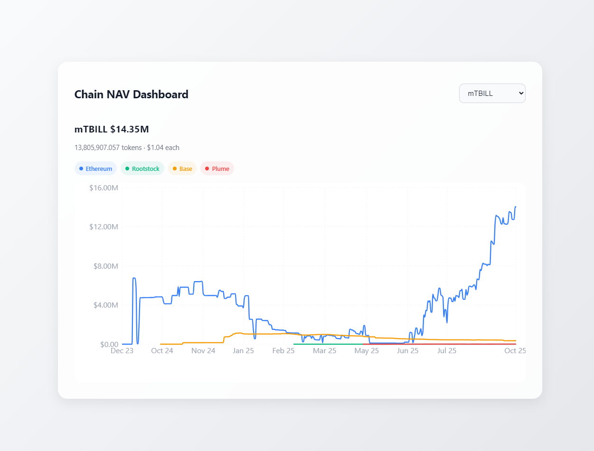

# Midas Indexer

The **Midas Indexer** tracks the **Net Asset Value (NAV)** of `mTBILL` tokens by using  **Envio** to index blockchain data and **React** to visualize it in an interactive web interface.



---

## 🚀 Quick Start

### 1. Run Envio Indexer

Start the indexer:

```bash
pnpm dev
```

Visit [https://envio.dev/console](https://envio.dev/console) to access the **GraphQL Playground**.

---

### 2. Run the Dashboard

The React dashboard visualizes mTBILL data:

```bash
cd midas-dashboard
pnpm start
```

This will launch the dashboard at [http://localhost:3000](http://localhost:3000) (default React port).

---

### Generate Code from Config or Schema

Generate TypeScript types and helpers from `config.yaml` or `schema.graphql`:

```bash
pnpm codegen
```

---

## ⚙️ Pre-requisites

Ensure the following are installed:

* [Node.js (v18 or newer)](https://nodejs.org/en/download/current)
* [pnpm (v8 or newer)](https://pnpm.io/installation)
* [Docker Desktop](https://www.docker.com/products/docker-desktop/) (optional, for containerized environments)

---

## 📊 Features

* **Tracks mTBILL NAV** over time across multiple chains.
* **Visualizes USD value, price, and normalized supply** via React charts.
* **Fills missing data points** automatically to maintain accurate historical charts.
* **Aggregate stats** displayed at a glance for quick insights.

---

## 📄 Documentation & Resources

* Envio documentation: [https://docs.envio.dev](https://docs.envio.dev)
* Project homepage: [https://envio.dev](https://envio.dev)

---

### ✅ Notes

* The **GraphQL Playground** allows interactive exploration of snapshots, aggregate supply, and other indexed data.
* Always run `pnpm codegen` after modifying `config.yaml` or `schema.graphql` to keep TypeScript types up to date.
* React charts dynamically display data per chain, connecting missing dates with the last known snapshot for continuity.

